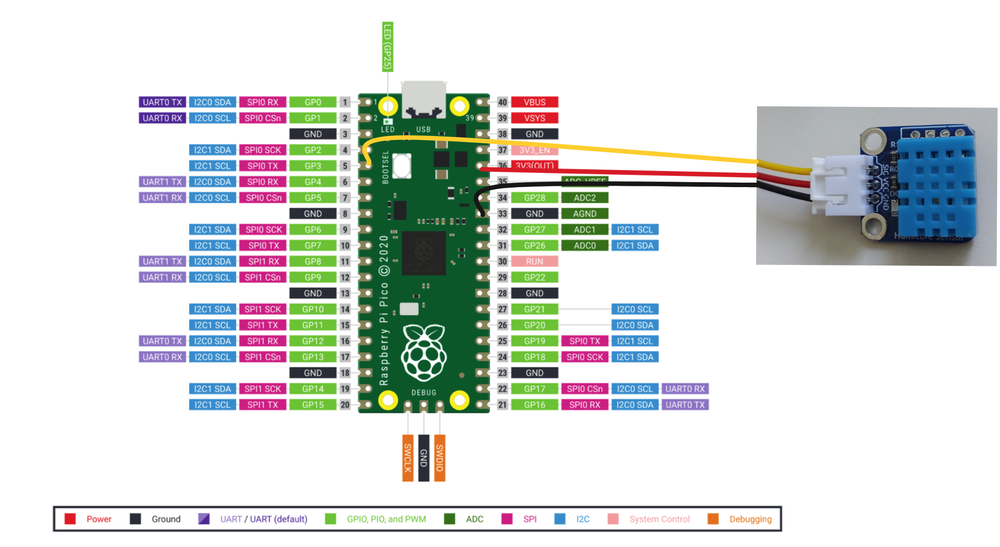

<!-- Image source for anemometer
Image by <a href="https://pixabay.com/users/ritae-19628/?utm_source=link-attribution&utm_medium=referral&utm_campaign=image&utm_content=3977718">-Rita-👩‍🍳 und 📷 mit ❤</a> from <a href="https://pixabay.com//?utm_source=link-attribution&utm_medium=referral&utm_campaign=image&utm_content=3977718">Pixabay</a> -->

In diesem Projekt zeige ich dir, wie du mit einem Raspberry Pi Pico und einem 
DHT11 Sensor eine einfache Wetterstation bauen kannst. Diese Wetterstation wird in der Lage sein, Temperatur und Luftfeuchtigkeit zu messen.

## Das brauchst du:

Um Deine eigene Messstation zu entwerfen, benötigst Du nur wenige Bauteile. Die meisten findest Du im Baumarkt oder kannst sie ganz einfach im Internet bestellen. 

- Raspberry Pi Pico
- DHT11 Sensor
- Breadboard
- Jumper-Kabel
- USB-Kabel zum Verbinden des Mikrocontrollers mit dem Computer
- Python und Thonny IDE

## Schritt 1: Hardware vorbereiten

- Raspberry Pi Pico und DHT11 verbinden
- Schließe den DHT11 Sensor an das Steckbrett an
- Verbinde die Juper-Kabel wie folgt:
  - VCC des DHT11 Sensors (rotes Kabel) an 3V3(OUT) des Pico
  - GND des Sensors (schwarzes Kabel) an GND des Pico
  - SIG(Data) des Sensors an GP3 (zum Beispiel)



## Schritt 2: Programmierung

Öffne die Thonny IDE und installiere die benötigte Bibliothek für den DHT11 Sensor. Dies kannst du in der Thonny IDE über das Menü "Tools" -> "Manage Packages" -> "dht" tun.

> Falls du Thonny IDE noch nicht installiert hast, folge dieser Anleitung.
> 
> Gehe auf diese Website und installiere dir zunächst die Entwicklungsumgebung, also das Programm, wo wir den Code schreiben werden: https://thonny.org/

Erstelle ein neues Python-Skript in der Thonny IDE und füge den folgenden Code ein:

```py
from dht import DHT11
import dht
import machine
import time

sensor = dht.DHT11(machine.Pin(3))
measurement = sensor.measure()

while True:
    print(sensor.temperature(), sensor.humidity())
    time.sleep(2)
```

Speichere das Skript und lade es auf den Raspberry Pi Pico hoch.
Öffne den Serial Monitor in der Thonny IDE, um die gemessenen Werte für Temperatur und Luftfeuchtigkeit anzuzeigen.
